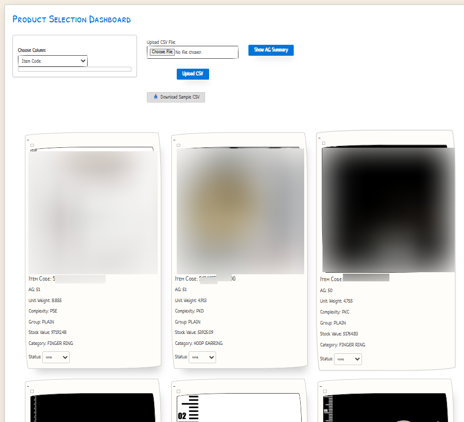

# 🧾 Product Selection Dashboard

An interactive and dynamic web dashboard built using **Flask**, **Python**, **HTML**, and **CSS** to upload, filter, select, and export product data from a CSV file. Featuring a clean Bejamas-style layout with Excel-like filtering, pagination, and product detail previews.

---



> *Above: Sample view of the Product Selection Dashboard with filters and hover effects.*

---

## ✨ Features

- 📁 Upload and view CSV data
- 🔍 Excel-style column filtering
- ✅ Checkbox product selection (retained across pages)
- 🧠 Hover view of product details (e.g., Unit Weight, Complexity Code)
- 📥 Download selected products (CSV)
- 📄 Customize sample CSV before download
- 📊 Slide-in panel filter for all columns
- 🔄 Auto reset selection on new upload
- 🎨 Clean, responsive UI (Bejamas-style layout)

---

## 🚀 Getting Started

### Prerequisites

- Python 3.7+
- `pip` installed

### Installation

```bash
git clone https://github.com/your-username/Product-Selection-Dashboard.git
cd Product-Selection-Dashboard
pip install -r requirements.txt
python app.py
